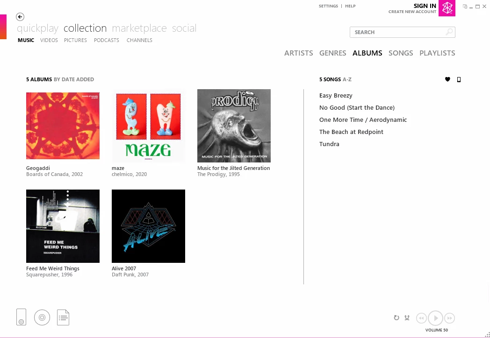
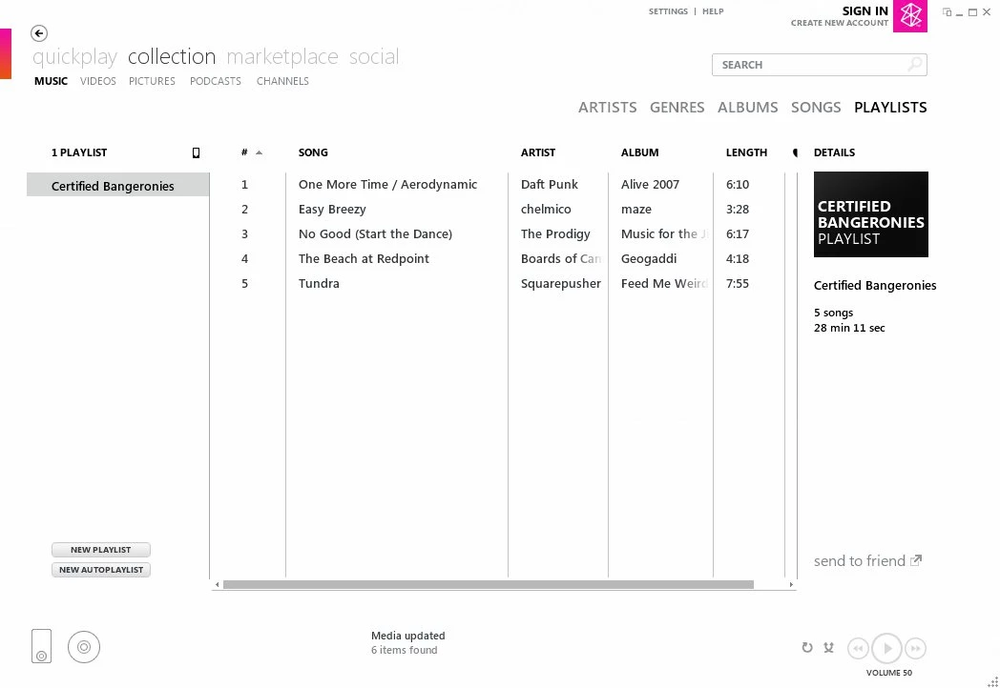

# Usage Guide

## Listing remote playlists

```sh
playlist-export -e .playlist-export-env --list
# or
playlist-export -e .playlist-export-env -l
```

**Example Output**

```sh
┌──────────────────────────────────────┬──────────────────────────────────┐
│               (index)                │               name               │
├──────────────────────────────────────┼──────────────────────────────────┤
│ 22fd6f1a-fcf1-4645-b614-b5ebab46eaaf │      '$ Added in past year'      │
│ ac826b8d-4ca8-4a6a-a646-3642cc981a4d │         '$ Last Played'          │
│ 75ac283e-9798-4455-ba88-3aa2e11c97fb │         '$ Most Played'          │
│ 933767ab-5792-472f-b871-c872060cbd04 │    '🔥 Certified Bangeronies'    │
└──────────────────────────────────────┴──────────────────────────────────┘
```

## Export Playlists and Songs without transcoding

We use the playlist ID from the `--list` above to export the remote playlist.

```sh
playlist-export -e .playlist-export-env --playlist 933767ab-5792-472f-b871-c872060cbd04
# or 
playlist-export -e .playlist-export-env -p 933767ab-5792-472f-b871-c872060cbd04
```

**Example Output**

```sh
[
  '🔥 Certified Bangeronies Playlist exported. [5 of 5 tracks exported (0 skipped, 0 removed, 0 failed.)])'
]
```

When listing the output of the `./exported` folder, you can see that the structure of exports follows the typical `artist -> album -> track` pattern.

```
$ find exported -type f

exported/music/Daft Punk/Alive 2007 [FLAC]/08 - One More Time _ Aerodynamic.flac
exported/music/chelmico/maze/01 - Easy Breezy.mp3
exported/music/The Prodigy/Music for the Jilted Generation/09 - No Good (Start the Dance).mp3
exported/music/Boards of Canada/Geogaddi [FLAC]/12 - The Beach at Redpoint.flac
exported/music/_Videogame Soundtracks and Covers/DJ Hero/33 - Daft Punk vs. Young MC - Around the World vs. Bust a Move.mp3
exported/.persist/379151e5ae80de9ac313476ce8aaba18
exported/🔥 Certified Bangeronies.m3u8
```

Note that the tracks are also in a `/music` subfolder. This is due to the path derived from the server, reflecting the track's actual location on the server. This may differ depending on the configuration of your server and the location of your music library.

### The exported playlist file

The playlist file is created alongside the tracks, and will reference the track locations with relative pathing by default:

**🔥 Certified Bangeronies.m3u8**

```m3u8
# Playlist Sync: paul@https://music.example.domain - 🔥 Certified Bangeronies.m3u8 [933767ab-5792-472f-b871-c872060cbd04]
# Created: 2024-10-26T15:33:16.700012644Z
# Updated: 2024-11-03T16:58:28.990108911Z
# Sync Options: [format=raw] [maxBitrate=0]
music/_Videogame Soundtracks and Covers/DJ Hero/33 - Daft Punk vs. Young MC - Around the World vs. Bust a Move.mp3
music/Daft Punk/Alive 2007 [FLAC]/08 - One More Time _ Aerodynamic.flac
music/chelmico/maze/01 - Easy Breezy.mp3
music/The Prodigy/Music for the Jilted Generation/09 - No Good (Start the Dance).mp3
music/Boards of Canada/Geogaddi [FLAC]/12 - The Beach at Redpoint.flac
```

### The persist cache

A persist cache is created that stores information about what playlists/tracks have been exported, and what format they were exported in. 

This allows for faster exports when you run the `playlist-export` command subsequent times on the same playlist. Tracks that have been downloaded previously are skipped, new tracks are added to the playlist, and remotely removed tracks are purged locally.

In the following example, a new track was added to my playlist, and one was removed:

```sh
playlist-export -e .playlist-export-env -p 933767ab-5792-472f-b871-c872060cbd04

```

**Output**

```sh
[
  '🔥 Certified Bangeronies Playlist exported.  [1 of 5 tracks exported (4 skipped, 1 removed, 0 failed.)])'
]

$ find exported -type f

exported/music/Daft Punk/Alive 2007 [FLAC]/08 - One More Time _ Aerodynamic.flac
exported/music/chelmico/maze/01 - Easy Breezy.mp3
exported/music/The Prodigy/Music for the Jilted Generation/09 - No Good (Start the Dance).mp3
exported/music/Boards of Canada/Geogaddi [FLAC]/12 - The Beach at Redpoint.flac
exported/music/Squarepusher/Feed Me Weird Things/02 - Tundra.mp3
exported/.persist/379151e5ae80de9ac313476ce8aaba18
exported/🔥 Certified Bangeronies.m3u8
```

Persist cache is enabled by default, but can be disabled by using `playlist-export --cache false`.


## Export Playlists and Songs with transcoding

Server-side transcoding will be activated when using `--maxBitrate` or `--format` flags.

```bash
playlist-export -e .playlist-export-env --playlist 933767ab-5792-472f-b871-c872060cbd04 --format mp3
```

**Example Output**

```sh
[
  '🔥 Certified Bangeronies Playlist exported. [5 of 5 tracks exported (0 skipped, 0 removed, 0 failed.)])'
]
```

In this instance, non-mp3 exported tracks are converted to mp3:

```
$ find exported -type f

exported/music/Daft Punk/Alive 2007 [FLAC]/08 - One More Time _ Aerodynamic.mp3
exported/music/chelmico/maze/01 - Easy Breezy.mp3
exported/music/The Prodigy/Music for the Jilted Generation/09 - No Good (Start the Dance).mp3
exported/music/Boards of Canada/Geogaddi [FLAC]/12 - The Beach at Redpoint.mp3
exported/music/_Videogame Soundtracks and Covers/DJ Hero/33 - Daft Punk vs. Young MC - Around the World vs. Bust a Move.mp3
exported/.persist/379151e5ae80de9ac313476ce8aaba18
exported/🔥 Certified Bangeronies.m3u8
```

## Export Playlists and Songs in Zune-Compatible mode

Zune software and players are notoriously finicky when it comes to path-names for tracks, as well as id3 tag versions. When using the `--zuneCompatibility` or `z` flag:

- The `artist -> album -> # - title` export path is replaced with a simple song ID as filename (The ID is derived from your server). This avoids Zune software's inability to import tracks with [non-Roman characters](https://en.wikipedia.org/wiki/Zune#Availability_outside_the_U.S.) or non-ASCII quote/dash marks.
- Id3 metadata is forced to id3 2.3, which has better support on Zune players.

```bash
playlist-export -e .playlist-export-env --playlist 933767ab-5792-472f-b871-c872060cbd04 --format mp3
```

**Example Output**

```sh
[
  '🔥 Certified Bangeronies Playlist exported. [5 of 5 tracks exported (0 skipped, 0 removed, 0 failed.)])'
]
```

```
$ find exported -type f

exported/70a3abe321acbce4b288b7f9ec3ace3d.mp3
exported/1ebdb7b5348dfb41510324c68e13ec61.mp3
exported/621a45efe2526ced7840550f3f88e60e.mp3
exported/79c3b45b3b761f5eb12799bca81ba517.mp3
exported/c0d0af95c7e3e91d08dc9c0312c13b7a.mp3
exported/.persist/379151e5ae80de9ac313476ce8aaba18
exported/🔥 Certified Bangeronies.m3u
```

When the contents of the `exported` folder is dragged to the user's music folder on a system with Zune, Zune uses the ID3 tags for artists/album organization:



And will import the m3u file as a Zune playlist:


